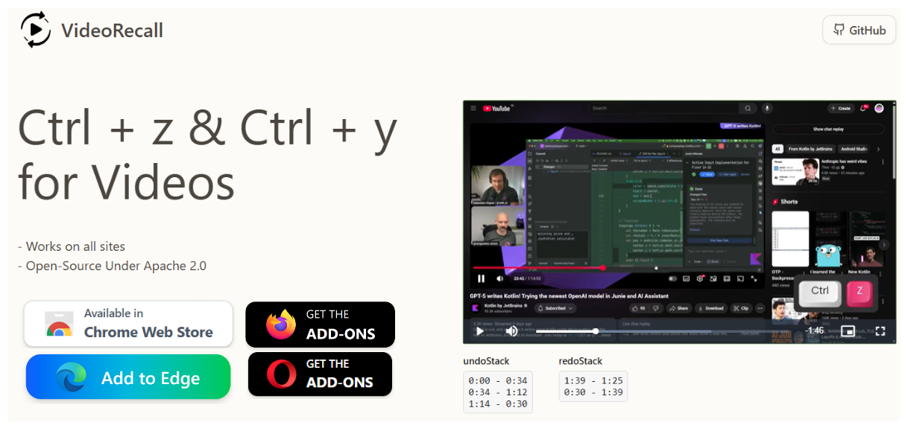

<div align="center">


# VideoRecall – Undo / Redo Your Video Seeks

Bring editor-style history to every online video. Jump back to where you were. Jump forward again. Never lose your place.

</div>

## 📎 See in Action (No Install Needed)

Try the functionality instantly in your browser here:

Seek around, then use Ctrl+Z / Ctrl+Y to experience undo / redo without installing the extension first.

<a href="https://videorecall.pages.dev/" target="_blank">
	
</a>

> Click the image to open the zero‑install live demo.

## 🤩 How It Feels

1. Start watching any video on a site.
2. Jump far ahead (click timeline / use chapter links / drag scrubber).
3. Press Ctrl+Z → You’re back exactly where you were.
4. Press Ctrl+Y → Forward jump restored.
5. Repeat. Explore without fear of “where was I?”

## 🔧 Install (Unpacked / Dev Mode)

Chromium (Chrome / Edge / Brave):

1. Open `chrome://extensions/`
2. Enable Developer Mode.
3. Load Unpacked → select the `extension` folder.
4. Open a video site (YouTube, Vimeo, news, courses, etc.) and try seeking.

Firefox (temporary):

1. Open `about:debugging#/runtime/this-firefox`
2. Click “Load Temporary Add-on”
3. Pick `extension/manifest.json`
4. Test on any page with a `<video>` element.

## ⚙️ How It Works (Simplified Flow)

```
Page loads → content.js marks install → observes DOM & shadow DOM
→ First playing <video> becomes activeVideo
→ 500ms interval watches currentTime
→ If |delta| > threshold (5s) ⇒ push {from,to} onto undoStack
→ Ctrl+Z pops undo → seek(from) & pushes onto redoStack
→ Ctrl+Y pops redo → seek(to) & pushes onto undoStack
```

## 🧠 Design Choices

- Interval polling (500ms) balances cost & responsiveness.
- Shadow DOM recursion only triggered if normal query finds zero videos (performance sensitive).

## 🔐 Privacy & Footprint

- No tracking, analytics, network calls, or storage persistence.
- No permissions beyond default content script execution.
- All logic in-page; nothing exfiltrated.

## 🛠 Configuration

Currently hard‑coded (edit & rebuild if you fork):

```
THRESHOLD seconds: 5
MAX STACK: 200
INTERVAL: 500ms
```

Adjust in `extension/content.js` (search for `diff > 5` and `200`).

## ❓ Really works on all sites?

Mostly – any site that exposes a standard HTML5 `<video>` element (including most players YouTube, Vimeo embeds, news sites, course platforms, social video, etc.).

If you find a site that doesn't work: please open an issue and include:

- Page URL
- Browser Name

Known constraints / edge cases:

- Closed shadow roots (cannot traverse by spec) – extension only scans open ones.

- Chromium native controls quirk: when your cursor is hovering the built‑in browser video progress bar, page key combos (Ctrl+Z / Ctrl+Y) may not fire. Move focus/hover off the bar (click elsewhere) and shortcuts work. Most modern sites ship their own custom styled controls so this usually isn’t an issue.

Still: for the vast majority of ordinary HTML5 video experiences it should “just work”. Report exceptions so they can be classified or supported.

## 🤝 Contributing

PRs welcome.

Want to help?

Safari?
If you have an Apple (Safari) developer account and like this idea:

1. Fork the repo.
2. In Xcode: File → New → Project → Safari Web Extension.
3. Drop the `extension/` files into the generated extension target.
4. Adjust `manifest.json` (icons / id) if needed.
5. Build, test, and submit. Please link back here so others can find it.

## 📄 License

See `LICENSE`.

## 🙏 Credits

Video.js (https://videojs.com/) – for the demo player foundation.
